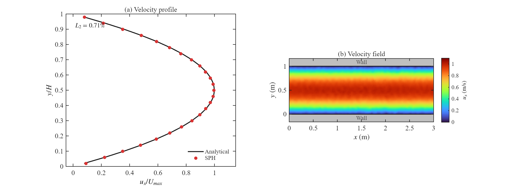

# SPH 平板泊肃叶流动模拟

基于**光滑粒子流体动力学 (Smoothed Particle Hydrodynamics, SPH)** 方法的二维平板泊肃叶流 (Poiseuille Flow) 数值模拟程序。采用 **MATLAB + C/MEX + OpenMP** 实现高性能计算。

## 物理问题

模拟两平行板之间的重力驱动层流（泊肃叶流动），该问题具有解析解，适合用于验证 SPH 方法的准确性。

**解析解：**

$$u(y) = \frac{g}{2\nu} y(H - y)$$

其中 $g$ 为体积力（等效压力梯度），$\nu = \mu/\rho_0$ 为运动粘度。

**默认模拟参数（config.ini）：**

| 参数 | 数值 | 说明 |
|------|------|------|
| 板间距 DH | 1.0 m | Y 方向流体域高度 |
| 通道长度 DL | 3.0 m | X 方向流体域长度（周期性边界） |
| 粒子间距 dp | 0.04 m | 空间分辨率（约 1875 粒子） |
| 参考密度 ρ₀ | 1.0 kg/m³ | 流体参考密度 |
| 动力粘度 μ | 0.1 Pa·s | 流体粘度 |
| 特征速度 U_f | 0.667 m/s | 用于计算雷诺数 |
| 声速因子 c_f | 10.0 | 人工声速 c = c_f × U_f |
| 仿真时间 | 5.0 s | 物理时间（通常 3-4s 达到稳态） |

## 数值方法

### 核心算法
- **核函数：** 2D Cubic Spline (Wendland C2)
- **邻居搜索：** Cell-Linked List（网格链表法），支持周期性边界
- **计算加速：** 模块化 MEX（邻居搜索 + 物理计算分离调用）+ OpenMP 多线程
- **时间积分：** 双层时间步进（外层对流步 + 内层声学步）
  - 对流时间步：基于 CFL 条件和粘性稳定性
  - 声学时间步：基于人工声速的 CFL 条件
- **密度计算：** 核函数求和 + 核梯度修正（Kernel Gradient Correction）
- **压力方程：** 弱可压缩状态方程 p = p₀(ρ/ρ₀ - 1)
- **粘性模型：** 基于核梯度修正的粘性力
- **传输修正：** Transport Velocity Correction（抑制数值扩散）
- **边界条件：**
  - X 方向：周期性边界（缓冲层宽度 4dp），fluid-wall 对同样做周期最小像距
  - Y 方向：4 层壁面虚粒子（镜像速度无滑移）+ BoundingFromWall 防穿透（SPHinXsys 风格）

### 架构特点（SPHinXsys 风格）
- **配置驱动：** 所有参数通过 `config.ini` 配置
- **Restart 机制：** 支持从断点续算（带配置签名验证）
- **粒子排序：** 定期按 Cell ID 排序提升缓存命中率
- **自动编译：** MEX 模块首次运行时自动检测并编译

## 模拟结果



- **左图：** 速度剖面对比（黑线 = 解析解，红点 = SPH 结果）
- **右图：** 粒子分布与速度场（彩色 = 流体粒子，灰色 = 壁面虚粒子）

**L2 相对误差 < 1%**，SPH 结果与解析解高度吻合。

## 运行方式

### 环境要求

- MATLAB R2018b 或更高版本
- 支持 OpenMP 的 C 编译器（推荐：Windows 使用 MSVC，Linux/macOS 使用 GCC）

### 快速开始

**方式1：MATLAB 交互式运行**
```matlab
run('SPH_Poiseuille.m')
```

**方式2：命令行批处理模式**
```bash
matlab -batch "run('SPH_Poiseuille.m')"
```

程序将自动完成：
1. MEX 模块检测与编译（首次运行）
2. 从 `config.ini` 读取参数
3. 粒子初始化（流体粒子 + 壁面虚粒子）
4. SPH 主循环计算
5. 输出结果对比图 `SPH_Poiseuille_result.png`

### MEX 编译

程序首次运行时会**自动检测并编译** MEX 加速模块，编译输出存放在 `build/` 目录，无需手动操作。

**手动编译（可选）：**

```matlab
% Windows (MSVC)
mex -R2018a -O COMPFLAGS="$COMPFLAGS /openmp" -output sph_neighbor_search_mex -outdir build mex/sph_neighbor_search_mex.c
mex -R2018a -O COMPFLAGS="$COMPFLAGS /openmp" -output sph_physics_mex -outdir build mex/sph_physics_mex.c

% Linux/macOS (GCC)
mex -R2018a -O CFLAGS="$CFLAGS -fopenmp" LDFLAGS="$LDFLAGS -fopenmp" -output sph_neighbor_search_mex -outdir build mex/sph_neighbor_search_mex.c
mex -R2018a -O CFLAGS="$CFLAGS -fopenmp" LDFLAGS="$LDFLAGS -fopenmp" -output sph_physics_mex -outdir build mex/sph_physics_mex.c
```

**注意：**
- MEX 编译失败时程序自动回退到 MATLAB 实现（性能较慢但功能完整）
- C 源文件位于 `mex/` 目录，编译产物存放在 `build/` 目录

### 参数配置

所有物理和数值参数通过 `config.ini` 配置，支持以下参数：

**物理参数 [physical]：**
- `DL`：流体域长度（X 方向，周期性边界）
- `DH`：流体域高度（Y 方向，壁面边界）
- `dp`：粒子间距（决定空间分辨率）
- `rho0`：参考密度
- `mu`：动力粘度
- `U_f`：特征速度（用于计算雷诺数）
- `c_f`：声速因子（人工声速 = c_f × U_f）

**仿真控制 [simulation]：**
- `end_time`：仿真终止时间（秒）
- `output_interval`：输出间隔（秒）
- `sort_interval`：粒子排序间隔（步数）
- `restart_from_file`：是否从 restart 文件续算（0=从零开始，1=续算）

### 环境变量控制（可选）

| 环境变量 | 作用 | 示例 |
|---------|------|------|
| `SPH_FORCE_MATLAB=1` | 禁用 MEX，强制使用 MATLAB 实现 | `$env:SPH_FORCE_MATLAB="1"` (PowerShell) |
| `SPH_T_END=<数值>` | 覆盖默认仿真终止时间（秒） | `$env:SPH_T_END="1.0"` |

**PowerShell 示例：**
```powershell
$env:SPH_T_END = "1.0"
matlab -batch "run('SPH_Poiseuille.m')"
Remove-Item Env:SPH_T_END
```

## 文件说明

| 文件/目录 | 说明 |
|------|------|
| `SPH_Poiseuille.m` | 主程序，包含完整的 SPH 模拟代码与 MATLAB 回退实现 |
| `config.ini` | 参数配置文件（物理参数 + 仿真控制） |
| `mex/sph_neighbor_search_mex.c` | 邻居搜索 MEX（C+OpenMP）：Cell-Linked List + 周期性边界 |
| `mex/sph_physics_mex.c` | 物理计算 MEX（C+OpenMP）：密度修正、粘性力、传输修正、时间积分 |
| `mex/sph_step_mex.c` | 旧版融合 MEX（保留供参考，接口不兼容） |
| `build/` | MEX 编译输出目录（自动生成，已在 `.gitignore` 中忽略） |
| `restart/` | Restart 文件存储目录（自动生成） |
| `SPH_Poiseuille_result.png` | 模拟结果可视化 |

## 性能优化建议

### 当前性能瓶颈
- **粒子分辨率**：dp=0.025 → 约 6000 粒子，计算复杂度 O(N×邻居数)
- **仿真时间**：3.0 秒（泊肃叶流通常 1-1.5 秒达到稳态）

### 优化方案（按效果排序）

| 配置 | dp | end_time | 粒子数 | 预期提速 | 适用场景 |
|------|----|---------:|-------:|---------:|----------|
| **快速调试** | 0.05 | 1.0 | ~1500 | **4-9x** | 算法验证、快速迭代 |
| **平衡配置** | 0.0333 | 1.5 | ~2700 | **2-3x** | 日常计算、合理精度 |
| **高精度** | 0.025 | 1.5 | ~6000 | **1.5-2x** | 发表级结果 |

**修改方式：** 编辑 `config.ini` 中的 `dp` 和 `end_time` 参数。

## 技术特性

### 1. 双层时间步进（Dual Time Stepping）
- **外层对流步**：基于 CFL 条件和粘性稳定性
- **内层声学步**：基于人工声速的 CFL 条件（`relaxation_time` 循环）
- 每个对流步内部执行多次声学步，确保数值稳定性

### 2. 核梯度修正（Kernel Gradient Correction）
- 自动计算修正矩阵 B（2×2）
- 修正后的核梯度：∇W_corrected = B · ∇W_original
- 提升边界附近的计算精度

### 3. 传输修正（Transport Velocity Correction）
- 抑制数值扩散，保持粒子分布均匀性
- 基于粒子数密度梯度计算修正速度
- 参数：`transport_coeff = 0.25`

### 4. 周期性边界（Periodic Boundary）
- X 方向周期性边界，缓冲层宽度 4dp
- 自动包裹粒子位置：x = mod(x, DL)
- 邻居搜索支持周期性镜像

### 5. Restart 机制
- 支持从断点续算，保存完整状态（位置、速度、密度、压力等）
- 配置签名验证：确保 restart 文件与当前配置一致
- 文件格式：MAT-file v7.3（支持大数据）

### 6. 粒子排序优化
- 定期按 Cell ID 排序（`sort_interval = 100` 步）
- 提升缓存命中率，加速邻居搜索
- 排序后自动重建邻居列表

## 参考文献

- Morris, J. P., Fox, P. J., & Zhu, Y. (1997). Modeling low Reynolds number incompressible flows using SPH. *Journal of Computational Physics*, 136(1), 214-226.
- Liu, G. R., & Liu, M. B. (2003). *Smoothed Particle Hydrodynamics: A Meshfree Particle Method*. World Scientific.
- Zhang, C., et al. (2020). SPHinXsys: An open-source multi-physics and multi-resolution library based on smoothed particle hydrodynamics. *Computer Physics Communications*, 267, 108066.

## 许可证

本项目仅供学习交流使用。
